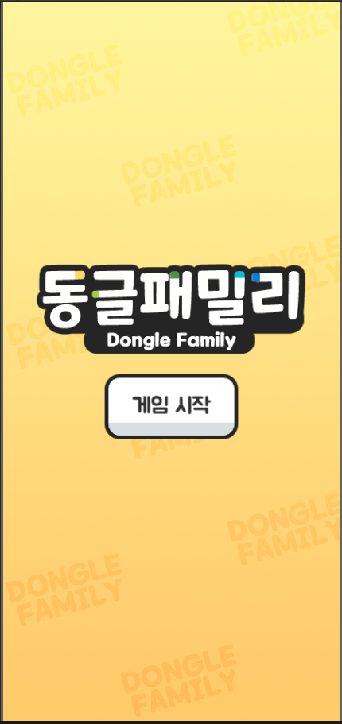
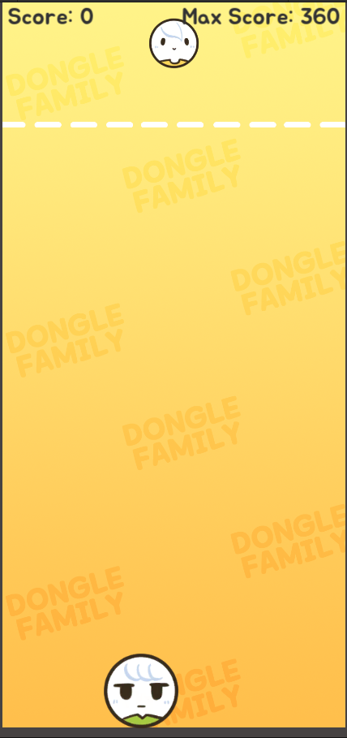
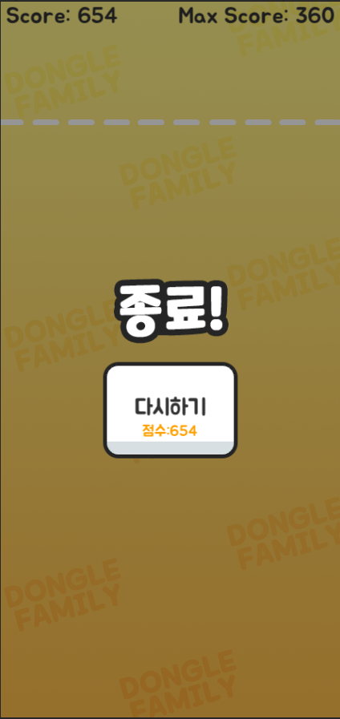

# DongleFamily
Unity 모바일 게임 프로젝트

일정 시간마다 동글 오브젝트가 하늘에서 생성되고 유저는 드래그를 하여 원하는 위치에 떨어뜨린다.
같은 동글이 충돌하는 경우 다음 동글로 레벨업하는 아케이드형 게임

메모리 누수를 방지하여 Object Pooling 방식을 사용

유튜버 골드메탈 게임 프로젝트 강의 완성본.

# 시작 화면

# 게임 화면

# 종료 화면

